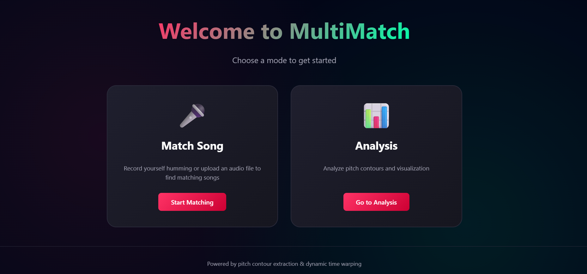
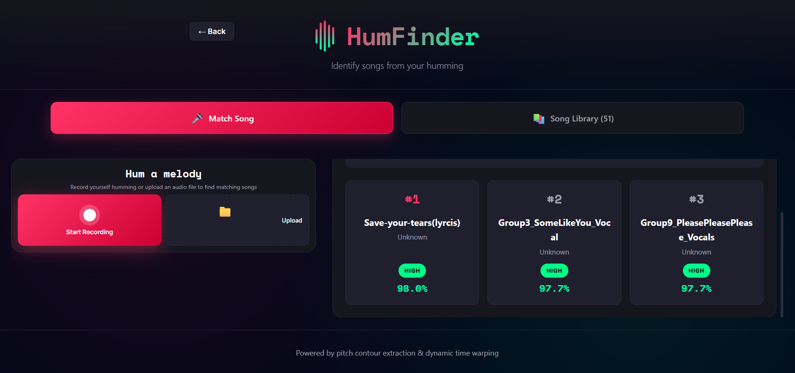
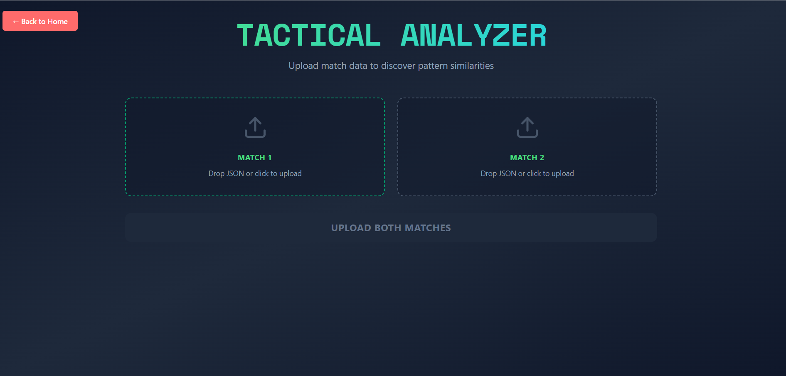
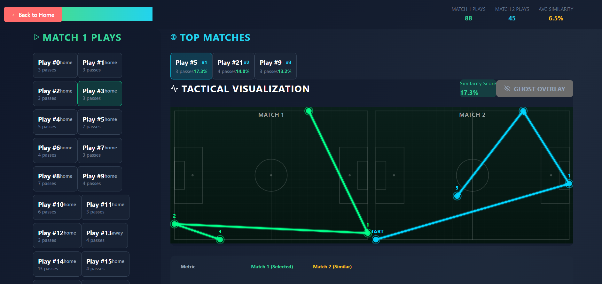
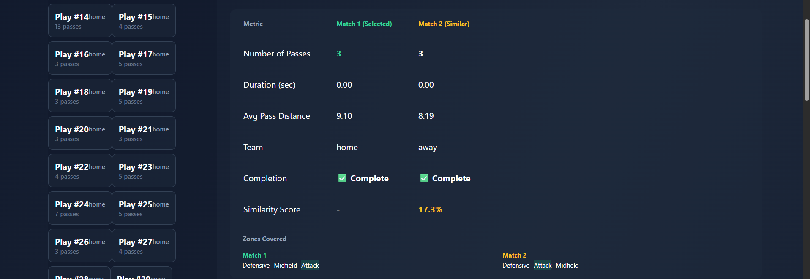
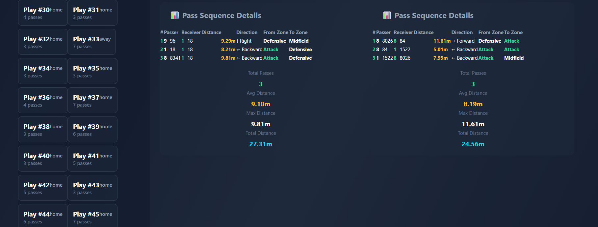

# HumFinder / MultiMatch

HumFinder is a humming-based song similarity detection system that identifies songs from short vocal snippets or hummed melodies. The project combines a React frontend, a Flask API, and a melody-matching pipeline built around pitch extraction, contour normalization, and similarity scoring.

## Project Overview

- **Frontend:** Vite + React application in `frontend/app`
- **Backend:** Flask API server in `backend/App.py`
- **Core workflow:** extract pitch from audio, reduce it to a melodic contour, compare it against the database, and rank the closest matches

## Features

- Identify songs from humming or short vocal recordings
- Robust pitch extraction with `librosa.pyin`
- Melody contour normalization to focus on relative motion instead of exact key
- DTW-based similarity matching against the song database
- Song library management through a REST API
- Interactive React dashboard for upload, match, and analysis flows

## Tech Stack

### Frontend
- React
- Vite
- Framer Motion
- Lucide React
- Recharts

### Backend
- Flask
- Flask-CORS

### Audio Processing
- Librosa
- NumPy
- SciPy

### Storage
- JSON metadata in `database/metadata.json`
- Serialized melody signatures in `.sig` files inside `backend/database/`

## Repository Layout

- `backend/` - Flask API, matching engine, audio processing utilities, and song database files
- `frontend/app/` - React UI for humming and song library interactions
- `Asset/` - Project screenshots used in this README

## Screenshots

The screenshots you provided are now stored in the repo-local `Asset/` folder and embedded below.













## Quickstart (Development)

- Backend (Windows, using `py` launcher):
```powershell
cd backend
py -3 -m venv .venv  # optional - only if you want a per-project venv
# If you already have Python packages globally or in user-site, you can install to user
py -3 -m pip install --user -r requirements.txt  # or install packages manually
py -3 App.py
```

- Frontend (requires Node.js 18+)
```bash
cd frontend/app
npm install
npm run dev -- --host 0.0.0.0
# Open http://localhost:5173/
```

## API Endpoints
- **GET** `/api/health` — health check and number of songs loaded.
- **GET** `/api/songs` — list songs in database and brief metadata.
- **POST** `/api/songs` — add a new song (multipart/form-data: `file`, `title`, `artist`, `duration`).
- **DELETE** `/api/songs/<song_id>` — delete a song.
- **POST** `/api/match` — match an uploaded humming file against the database (multipart/form-data: `file`, optional `top_k`).
- (If present) **POST** `/api/analyze` — compare two match JSON files (used by the analysis dashboard). If you rely on analysis flows, ensure the backend exposing `/api/analyze` is running.

### Example Response

The matcher returns a detailed payload with similarity values normalized from the DTW distance using `1 / (1 + distance)`.

```json
{
	"query": {
		"pitch_length": 214,
		"contour_length": 213,
		"valid_pitch_ratio": 0.78
	},
	"matches": [
		{
			"song_id": "123",
			"title": "Shape of You",
			"artist": "Ed Sheeran",
			"distance": 0.11,
			"similarity_score": 0.90,
			"confidence": "high"
		},
		{
			"song_id": "456",
			"title": "Perfect",
			"artist": "Ed Sheeran",
			"distance": 0.22,
			"similarity_score": 0.82,
			"confidence": "high"
		}
	]
}
```

## Methodology

- **Audio preprocessing:** Input audio is converted to mono and resampled to a canonical sample rate (typically 22050 Hz) using `librosa.load`.

- **Pitch extraction:** The pipeline uses `librosa.pyin` (pYIN) to estimate frame-wise fundamental frequency (F0), voiced/unvoiced state, and confidence scores. pYIN is well suited for humming and vocal melody tracking because it is more robust than simple autocorrelation-based approaches.

- **Cleaning and interpolation:** Low-confidence frames and unvoiced frames are masked, short gaps are interpolated, and a median filter removes spurious outliers.

- **Contour construction:** Continuous pitch values are converted into a simplified melodic contour with labels of `+1` (rising), `0` (stable), or `-1` (falling). This intentionally reduces sensitivity to absolute pitch and keeps the focus on relative melody movement.

- **Signature generation and storage:** Each song is stored as a `MelodySignature` containing the pitch contour, raw pitch values, song id, and duration. Signatures are persisted in the `database/` folder for fast loading.

- **Matching algorithm:** The humming signature is compared against all song signatures using normalized DTW over contour values. The DTW cost function treats equal contours as `0`, one stable vs. one moving as `1`, and opposite directions as `2`. The final score is converted to similarity with `1 / (1 + distance)`.

- **Metadata enrichment:** Match results are merged with metadata from `database/metadata.json` so the UI can show song title, artist, confidence, and similarity score.

### Design Decisions

- Using `pYIN` gives a robust pitch estimate for vocals and humming.
- Contour quantization reduces sensitivity to key changes and shifts the comparison toward melodic shape.
- Sequence-based similarity is more forgiving than exact waveform matching when users hum at a different tempo or with partial phrases.

### Performance & Tuning

- Reducing `hop_length` increases pitch resolution at the cost of CPU.
- `fmin` and `fmax` can be adjusted to better match the expected vocal range of the dataset.
- Database matching is currently an O(N) scan. For larger libraries, an approximate nearest-neighbor layer would be a natural next optimization.

## Evaluation

There is no formal benchmark table checked into the repository yet, so this section is intentionally honest about the current state.

- **Current loaded library:** 51 songs in the live backend run
- **Match output:** ranked candidates with distance, similarity score, and confidence label
- **Strengths observed in code:** melody-shape matching is resilient to key changes and moderate tempo variation
- **Recommended next metrics to publish:** Top-1 accuracy, Top-5 accuracy, average query time, and dataset size used for evaluation

## Troubleshooting

- If the backend fails to import `librosa` or `numpy`, install dependencies with the Python launcher: `py -3 -m pip install --user flask flask-cors numpy librosa scipy soundfile`.
- On Windows, long paths or non-ASCII paths can cause problems for some binary wheels or the venv launcher. Using `py -3` is usually the most reliable approach.
- You may see warnings about incompatible preinstalled packages such as `openvino`. Those warnings are environment-level conflicts and do not necessarily block this app.

## Credits

- Attribution: Original project code.
- Libraries: `librosa`, `numpy`, `scipy`, `flask`, `react`, `vite`.
